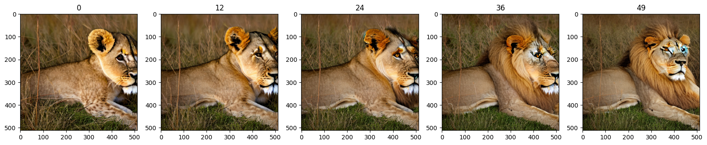
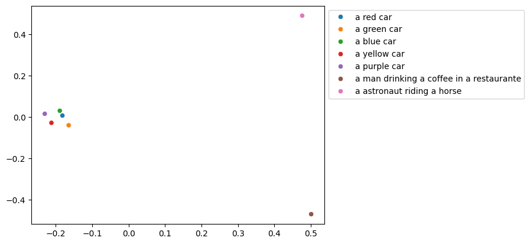
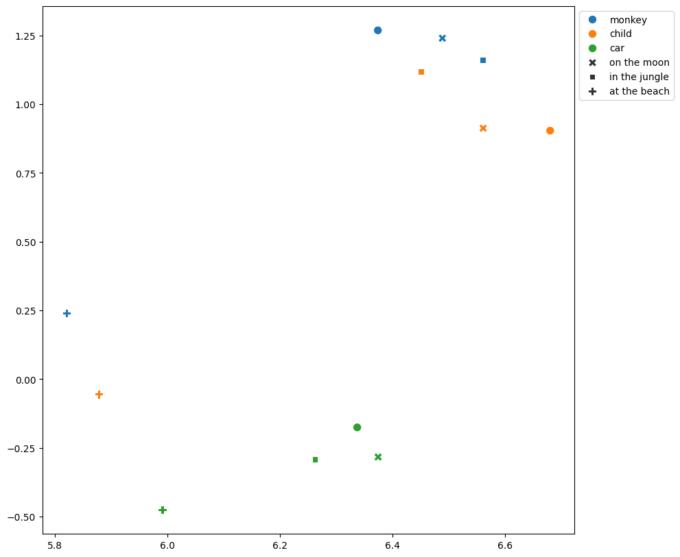

# Exploring the Latent Space of CLIP

#### Abstract

 Connecting text and image modalities in machine learning poses a significant challenge due to the inherent differences in their properties.
    Contrastive Language-Image Pretraining (CLIP) addresses this challenge by training a shared latent space between text and images, thereby unlocking new possibilities.
    Comprehending this multimodal latent space is essential for various applications, such as text-guided image editing.
    This project focuses on a comprehensive exploration of the latent space of CLIP through the examination of encoded text prompts.
    By employing dimensionality reduction techniques such as PCA and UMAP, we gain valuable insights into the relationships among encoded prompts.
    Our experiments involving linear interpolation reveal that even between related prompts, meaningful content is preserved in the encoded representations.
    Furthermore, an analysis of the changes occurring when modifying specific properties of prompts suggests the potential to disentangle the latent space of CLIP.

 ## The full project report is available here => [exploringCLIP](assets/exploringCLIP.pdf)

## Some insights from the project report

### PCA
Using PCA, we reduced the 768 dimensions of CLIP text
embeddings to 2 dimensions, allowing the creation of a scatterplot
for prompts encoded by the CLIP text encoder  

### UMAP
This PCA mapping is only fitted to the few embeddings shown in the
plot so it does not represent the whole CLIP space. To obtain a more
representative projection of the entire CLIP space, we fitted a UMAP
model to ten thousand CLIP embeddings created by randomly sampling
captions from the DataComp-1B dataset and encoding them with the
CLIP text encoder. Given the curse of dimensionality, cosine similarity
was employed as the distance measure, to deal with the challenges
of high-dimensional data. Cosine similarity is particularly effective
in such scenarios because it compares the direction of two vectors,
providing a robust measure of similarity that is less sensitive to the
dimensionality of the data. This approach helps mitigate the adverse
effects of sparse space, making it a suitable choice for comparing
and analyzing high-dimensional embeddings.  

### Interploation

To gain insight into the relationships among text embeddings and the
space between them, we employed interpolation. Initially, we generated
two CLIP embeddings as start and end points by inputting two manually
selected prompts into the CLIP text encoder. Using linear interpolation,
we calculated 48 additional embeddings between the two initial ones.
To visually examine these embeddings, we employed stable diffusion
to generate images with a fixed seed and conditioned the U-Net on the
interpolated CLIP embeddings. Our experiments focused on prompts
where only a single variable of a fixed object changed, such as the
location/background or color of an object.

(see teaser figure)

